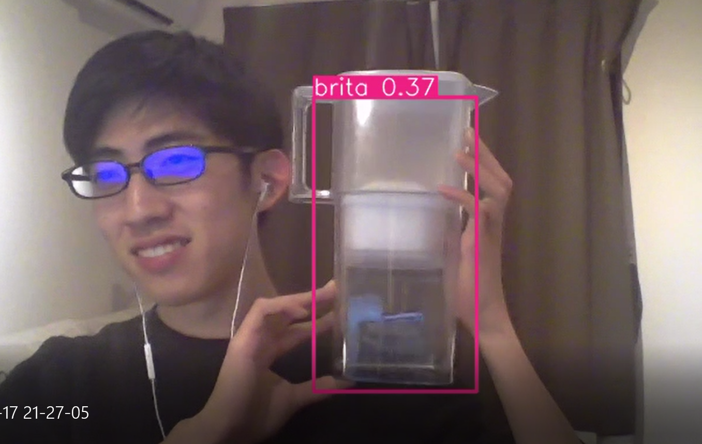

# Finding my Brita with Yolov5

## Implementation

Please run these codes in a Jupyter Notebook
<br>

### <ins>Prepare Directory

1.  Create Directory to store images and annotated data<br>(In case you still haven't annotated your data, please check my [blog](https://kyosukefukumoto.blog/54-annotating-images-with-labelimg/) to see how you can do it! )

        ```
        /Working Directory/
        ├─data
        │  ├─images #Images of your brita(well it doesn't have to be a brita)
        │  │　├─1.jpg
        │  │　├─2.jpg
        │  │  └─...
        │  └─labels ＃Annotated Data using LabelIMG
        │   　├─classes.txt　
        │   　├─1.txt　　
        │   　├─2.txt
        │     └─...
        ...
        ```

    <br>

### <ins>Prepare for Inference

1. Import torch and torchvision

   ```
   !pip install torch==1.8.1+cu111 torchvision==0.9.1+cu111 torchaudio===0.8.1 -f https://download.pytorch.org/whl/lts/1.8/torch_lts.html
   ```

1. CLONE Yolov5 repo

   ```
   !git clone https://github.com/ultralytics/yolov5
   ```

1. Create [_dataset.yml_](./dataset.yml) under the cloned yolov5 directory

   ```
   /Working Directory/
   ├─data
   │  ├─images
   │  │　├─1.jpg
   │  │　├─2.jpg
   │  │  └─...
   │  └─labels ＃Annotated Data using LabelIMG
   │   　├─classes.txt　
   │   　├─1.txt　　
   │   　├─2.txt
   │     └─...
   └─yolov5　#previously cloned yolov5 repo
         └─dataset.yml
   ```

1. Install Requirements

   ```
   !cd yolov5 & pip install -r requirements.txt
   ```

    <br>

### <ins>Transfer Learning

1.  Import

    ```
    import torch
    from matplotlib import pyplot as plt
    import numpy as np
    import cv2
    ```

1.  Load yolov5s (Small version)

    ```
    model = torch.hub.load('ultralytics/yolov5', 'yolov5s')
    ```

1.  Assign the [_dataset.yml_](./dataset.yml) you previously created and start training<br>
    [--weights]:Weights you're using for training<br>
    [--workers]:Too many worker may stop the process at midpoint

    ```
    !cd yolov5 && python train.py --img 320 --batch 16 --epochs 500 --data dataset.yml --weights yolov5s.pt --workers 2
    ```

    ※The directory after you finished training would look like this

    ```
    /Working Directory/
    ├─data
    │  ├─images
    │  └─labels
    └─yolov5
        ├─.github
        ├─data
        ├─models
        ├─runs
        │  └─train
        │      ├─exp
        │      │  └─weights
        │      └─exp15
        │          └─weights　＃Created after last step
        ├─utils
        └─__pycache__
    ```

    <br>

### <ins>Finding my BRITA

1. Load the model using the _.pt_ file created on the previous step

   ```
   model = torch.hub.load('ultralytics/yolov5', 'custom', path='yolov5/runs/train/exp15/weights/last.pt', force_reload=True)
   ```

1. Open Camera and run inference

   ```
   cap = cv2.VideoCapture(0)
   while cap.isOpened():
       ret, frame = cap.read()

       # Make detections
       results = model(frame)

       cv2.imshow('YOLO', np.squeeze(results.render()))

       if cv2.waitKey(10) & 0xFF == ord('q'):
           break
   cap.release()
   cv2.destroyAllWindows()
   ```

    <br>

# As you can see, I am CLEARY satisfied


