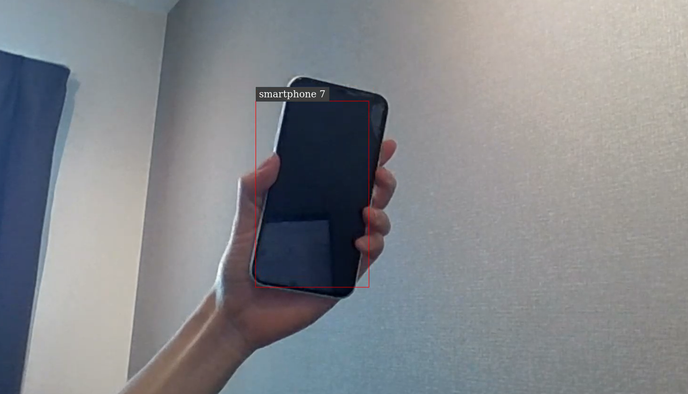

# Detecting Smartphone with Peoplenet

## Prerequisites

Jetson NANO

- Ubuntu 18.04
- Jetpack 4.4
- CUDA 10.2
- TensorRT 7.1.3
- DeepStreamSDK 5.0.1

GPU to train model using Nvidia TLT(GP102 [GeForce GTX 1080 Ti])

- Ubuntu 18.04
- CUDA 10.2
- Docker 20.10.7
- NVIDIA Docker 2.9.1
- NVIDIA-SMI 440.36
- DriverVersion 440.36
- TLT 2

## Model

- [PeopleNet](https://catalog.ngc.nvidia.com/orgs/nvidia/models/tlt_peoplenet/version)<br>

    <br>

## TLT Implementation

#### <ins>Run TLT Docker Container</ins>

1. If you haven't finished installation yet, go check out [TLT2.0 Installation](https://docs.nvidia.com/tao/archive/tlt-20/tlt-user-guide/text/requirements_and_installation.html)

1. Pull Container

   ```shell
   docker pull nvcr.io/nvidia/tlt-streamanalytics:v2.0_py3
   ```

1. Create local directory to mount the _tlt-experiments_ directory inside the docker container

   ```shell
   mkdir /home/$USERNAME/tlt-experiments
   ```

1. Run Docker Container

   ```shell
   docker run --runtime=nvidia -it -v /home/$USERNAME/tlt-experiments:/workspace/tlt-experiments -p 8888:8888 nvcr.io/nvidia/tlt-streamanalytics:v2.0_py3 /bin/bash
   ```

   <br>

#### <ins>Convert training data to _tfrecord_</ins>

1. Follow this step [here](./DataPreparation/README.md)

<br>

#### <ins>Transfer-learning using TLT</ins>

1. Create Directory for this tutorial and change directory<br>

   ```shell
   mkdir /workspace/tlt-experiments/peoplenet
   cd /workspace/tlt-experiments/peoplenet
   ```

1. Create Directory to Save Pre-trained models

   ```shell
   mkdir /workspace/tlt-experiments/models
   ```

1. Download Pre-trained model and save it under the directory we previously created

   ```shell
   ngc registry model download-version nvidia/tlt_peoplenet:unpruned_v1.0 \
   --dest /workspace/tlt-experiments/models
   ```

1. Create Spec file for training, [_peoplenet_train_smartphone_kitti.txt_](peoplenet_train_smartphone_kitti.txt)
   <br>
   ※MEMO

   ```
   random_seed: 42
   dataset_config {
   data_sources {
       tfrecords_path: "/workspace/tlt-experiments/smartphone_data/tfrecords/kitti_trainval/*" # Path to tfrecord
       image_directory_path: "/workspace/tlt-experiments/smartphone_data/training"　# Directory to Images
   }
   image_extension: "jpg" # Change depending on the image you are using

   ...

   augmentation_config {
      preprocessing {
         output_image_width: 1280 #Same as input image
         output_image_height: 720 #Same as input image
         min_bbox_width: 0.5
         min_bbox_height: 2.0
         output_image_channel: 3
      }

   ...

   model_config {
     pretrained_model_file: "/workspace/tlt-experiments/models/tlt_peoplenet_vunpruned_v1.0/resnet34_peoplenet.tlt"
   #Path to pretrained model
   num_layers: 34

   #Freeze all blocks except last block
   freeze_blocks: 0
   freeze_blocks: 1
   freeze_blocks: 2

   ...

   training_config {
   batch_size_per_gpu: 10
   num_epochs: 300

   ...

   cost_function_config {
      target_classes {
         name: "smartphone"
         class_weight: 1.0
         coverage_foreground_weight: 0.0500000007451
         objectives {
            name: "cov"
            initial_weight: 1.0
            weight_target: 1.0
         }
         objectives {
            name: "bbox"
            initial_weight: 10.0
            weight_target: 1.0
         }
   }
   ...

   ```

1. Run Re-training

   - -r : Output Directory
   - -n : Output file name as _detectnet.tlt_

   ```shell
   tlt-train detectnet_v2 -e ./peoplenet_train_smartphone_kitti.txt \
   -r ./unpruned_batch_10 \
   -k tlt_encode \
   -n detectnet_unpruned \
   --gpus 1
   ```

   <br>

#### <ins>Prune Model to increase inference speed</ins>

1. Directory to save Pruned model

   ```shell
   mkdir -p ./pruned_b10
   ```

1. Prune as _detectnet_nopool_pruned.tlt_

   ```shell
   tlt-prune -m ./unpruned_batch_10/weights/detectnet_unpruned.tlt \
   -o ./pruned_b10/detectnet_nopool_pruned.tlt \
   -eq union \
   -pth 0.01 \
   -k tlt_encode
   ```

<br>

#### <ins>Retrain after Pruning to recover inference precision</ins>

1. Create Spec file for retraining(_peoplenet_retrain_smartphone_kitti.txt_) and re-run training (export as _detectnet_pruned.tlt_)

   ```shell
   tlt-train detectnet_v2 -e ./peoplenet_retrain_smartphone_kitti.txt \
   -r ./retrain_b10 \
   -k tlt_encode \
   -n detectnet_pruned \
   --gpus 1
   ```

   <br>

#### <ins>Export as INT8</ins>

1. Create Directory to store int8 calibration file

   ```shell
   mkdir ./final_b10
   ```

1. Generate INT8 calibration file

   - -m : Calibration Batch size

   ```shell
   tlt-int8-tensorfile detectnet_v2 -e ./peoplenet_retrain_smartphone_kitti.txt \
   -m 2 \
   -o ./final_b10/calibration.tensor
   ```

1. Export data as _detectnet.etlt_

   - --batches :Same number of batch when you exported model as INT8
   - --batch*size : Same as \_batch_size_per_gpu* in _peoplenet_train_smartphone_kitti.txt_

   ```shell
   tlt-export detectnet_v2 \
   -m ./retrain_b10/weights/detectnet_pruned.tlt \
   -o ./final_b10/detectnet.etlt \
   -k tlt_encode \
   --cal_data_file ./final_b10/calibration.tensor \
   --data_type int8 \
   --cal_cache_file ./final_b10/calibration.bin \
   --batches 2 \
   --verbose \
   --batch_size 10
   ```

   <br>

## Deepstream Implementation

#### <ins>Running on DeepStream</ins>

1. Create Directory and move inside

   ```shell
   cd ~
   mkdir ds_tlt_smartphone
   cd ds_tlt_smartphone
   ```

1. Copy _detectnet.etlt_ and _calibration.bin_ which you generated in the last step(It's stored inside /workspaces/tlt-experiments/peoplenet/final_b10), and save it in current directory

1. Download tlt-converter（[HERE](https://docs.nvidia.com/tao/archive/tlt-20/tlt-user-guide/text/deploying_to_deepstream.html#generating-an-engine-using-tlt-converter)）and same it inside current directory

1. Set user settings to enable using tlt-converter

   ```shell
   chmod +x tlt-converter
   ```

1. Convert the 2 files to _detectnet.trt_

   ```shell
   ./tlt-converter \
   ./detectnet.etlt \
   -k tlt_encode \
   -c ./calibration.bin \
   -o output_cov/Sigmoid,output_bbox/BiasAdd \
   -d 3,720,1280 \
   -i nchw \
   -t int8 \
   -e ./smartphone_detector.trt \
   -b 10
   ```

1. Create labels file ([_labels.txt_](./FilesForDeepstream/labels.txt))
1. Create Deepstream-app pipeline config([_deepstream_app_config_smartphone_tlt.txt_](./FilesForDeepstream/deepstream_app_config_smartphone_tlt.txt))
1. Create config file for inference([_config_infer_smartphone_tlt.txt_](./../../FilesForDeepstream/config_infer_smartphone_tlt.txt))

1. Run APP

   ```shell
   deepstream-app -c deepstream_app_config_smartphone_tlt.txt
   ```

   
   <br>

## REFERENCES

- [TLT2.0: Documentation](https://docs.nvidia.com/tao/archive/tlt-20/tlt-user-guide/text/overview.html#)
- [Youtube: Tutorial](https://www.youtube.com/watch?v=5SA809OKtdQ)
