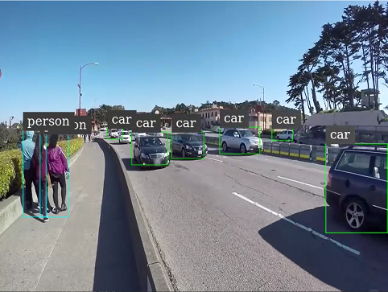

# SSD_MobileNet_v2_coco_2018_03_29

## Prerequisites

- Jetson NANO
- Ubuntu 18.04
- Jetpack 4.4
- CUDA 10.2
- TensorRT 7.1.3
- DeepStreamSDK 5.0.1
- TensorFlow 1.15.4 [[HOW TO INSTALL]](../README.md)
  <br>
  <br>

## Model References

- [TensorFlow 1 Detection Model Zoo](https://github.com/tensorflow/models/blob/master/research/object_detection/g3doc/tf1_detection_zoo.md)<br>
- [SSD_MobileNet_v2_coco_2018_03_29](http://download.tensorflow.org/models/object_detection/ssd_mobilenet_v2_coco_2018_03_29.tar.gz)
  <br>
  <br>

## Implementation

<br>

### <ins>Install Text Editor

```
sudo apt-get install nano
```

<br>

### <ins>Create Directory for deepstream-app

1. Create Directory

   ```
   mkdir ~/ssd_mobilenet_v2
   ```

1. Move Directory

   ```
   cd ssd_mobilenet_v2
   ```

<br>

### <ins>Get Files(Model/Label/PostProcessingParser)

1. Get Model

   ```
   wget -qO- http://download.tensorflow.org/models/object_detection/ssd_mobilenet_v2_coco_2018_03_29.tar.gz | tar xvz -C ~/ssd_mobilenet_v2/
   ```

1. Copy sample label file to current directory

   ```
   cp /usr/src/tensorrt/data/ssd/ssd_coco_labels.txt .
   ```

1. Change Directory to where you can _build_ the post-process parser

   ```
   cd /opt/nvidia/deepstream/deepstream-5.0/sources/objectDetector_SSD
   ```

1. Check Current Version of CUDA

   ```
   nvcc -V
   ```

1. My CUDA version was 10.2, so I'll assign that and build the parser

   ```
   sudo CUDA_VER=10.2 make -C nvdsinfer_custom_impl_ssd
   ```

1. Go back to deepstream-app directory you previously built

   ```
   cd ~/ssd_mobilenet_v2
   ```

1. Copy built .so file to current directory

   ```
   cp /opt/nvidia/deepstream/deepstream-5.0/sources/objectDetector_SSD/nvdsinfer_custom_impl_ssd/libnvdsinfer_custom_impl_ssd.so .
   ```

<br>

### <ins>Convert model to UFF

1. create [_config_ssd_mobilenet.py_](./config_ssd_mobilenet.py)

   ```
   nano config_ssd_mobilenet.py
   ```

1. Convert to UFF as _sample_ssd_mobilenet.uff_

   ```
   python3 /usr/lib/python3.6/dist-packages/uff/bin/convert_to_uff.py \
   ~/ssd_mobilenet_v2/ssd_mobilenet_v2_coco_2018_03_29/frozen_inference_graph.pb -O NMS \
   -p ./config_ssd_mobilenet.py \
   -o ./sample_ssd_mobilenet.uff
   ```

<br>

### <ins>Create Deepstream-app pipeline config

1. Create [_deepstream_app_config_ssd_mobilenet.txt_](./deepstream_app_config_ssd_mobilenet.txt)

   ```
   nano deepstream_app_config_ssd_mobilenet.txt
   ```

   **NOTE**: <br>

   ```

   [source0]
   ...
   #Input Data Type:Type 1=CameraV4L2 2=URI 3=MultiURI 4=RTSP
   type=3

   #Path to input video
   uri=file:/opt/nvidia/deepstream/deepstream/samples/streams/sample_1080p_h264.mp4

   [sink0]
   ...
   #Container format to store video and audio data:1=mp4,2=mkv
   container=1

   #Video data compression method:1=h264,2=h265
   codec=1

   #Output Path
   output-file=out_ssd_mobilenet.mp4

   ...
   [primary-gie]
   ...
   #Change bbox color per class
   bbox-border-color0=1;0;0;1
   bbox-border-color1=0;1;1;1
   bbox-border-color2=0;0;1;1
   bbox-border-color3=0;1;0;1

   #path to config file which we will create on our next step
   config-file=config_infer_ssd_mobilenet.txt

   ...
   ```

1. Create [_config_infer_ssd_mobilenet.txt_](./config_infer_ssd_mobilenet.txt)

   ```
   nano config_infer_ssd_mobilenet.txt
   ```

   **NOTE**: <br>

   ```
   [property]
   ...
   #Path to engine file(We don't have this file yet)
   model-engine-file=sample_ssd_mobilenet.uff_b1_gpu0_fp32.engine

   #path to label data
   labelfile-path=ssd_coco_labels.txt

   #path to uff-file
   uff-file=sample_ssd_mobilenet.uff
   ...
   #path to previously built *.so* file
   custom-lib-path=libnvdsinfer_custom_impl_ssd.so
   ...

   ```

   **NOTE**: <br>
   ※If the engine file does not exist when the app starts, it will automatically look for the uff file and build an engine from that.
   Which also means, if you already have your engine file, it will use that file without looking through the uff file

<br>

### <ins>Start DeepStream-App

1. Run at current directory（~/ssd_mobilenet_v2 )

   ```
   deepstream-app -c deepstream_app_config_ssd_mobilenet.txt
   ```

1. ※What your directory would look like

   ```
   ~/ssd_mobilenet_v2/
   ├── config_infer_ssd_mobilenet.txt
   ├── config_ssd_mobilenet.py
   ├── deepstream_app_config_ssd_mobilenet.txt
   ├── libnvdsinfer_custom_impl_ssd.so
   ├── out_ssd_mobilenet.mp4
   ├── sample_ssd_mobilenet.uff
   ├── sample_ssd_mobilenet.uff_b1_gpu0_fp32.engine
   ├── ssd_coco_labels.txt
   └── ssd_mobilenet_v2_coco_2018_03_29
   ```

<br>

### <ins>Output Results


<br>
